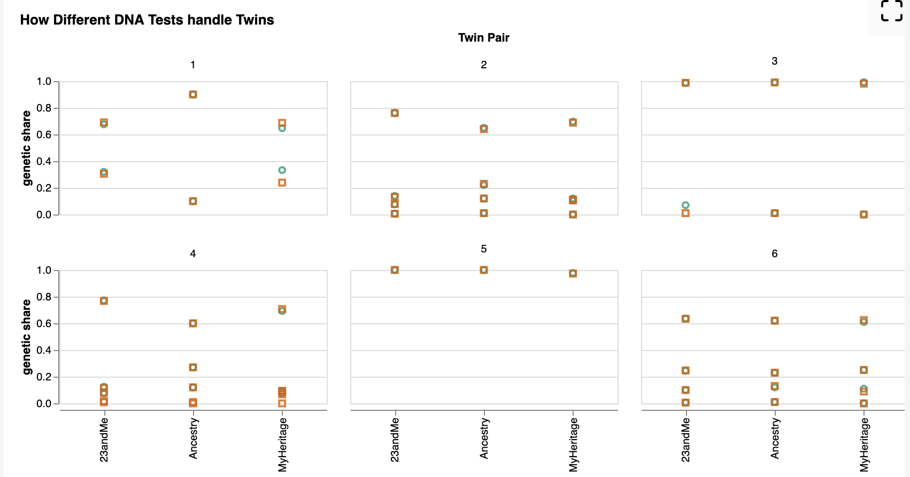
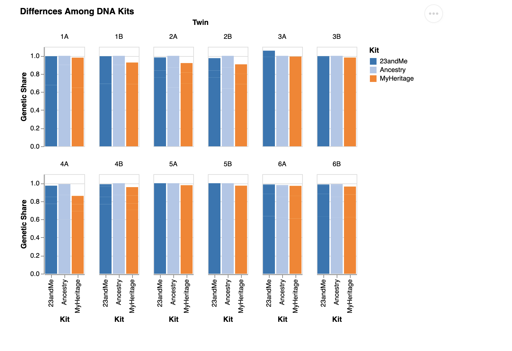
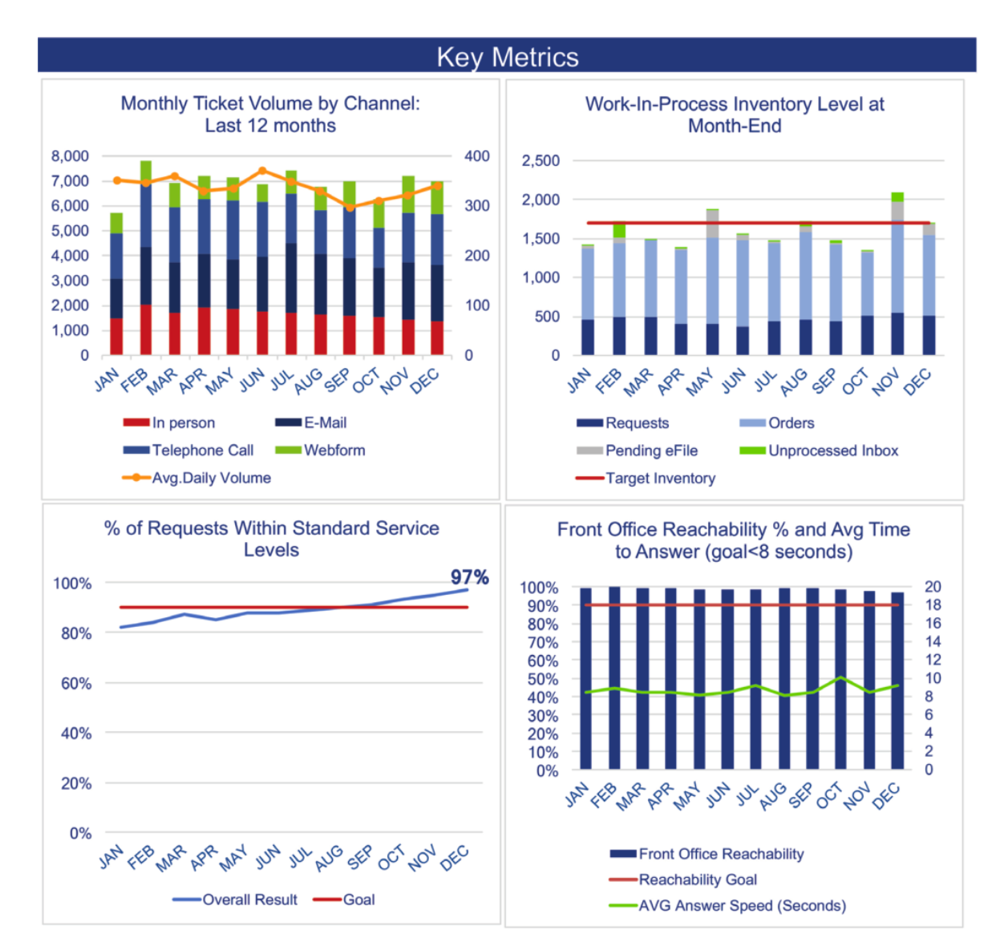

This is where I'll complete the exercises for the final portfolio.

## Exercise 1

# a.

One thing I really like about this graphic(Graphic 4) is that it uses both color and shape to distinguish twin A from twin B. A lot of plots just rely on color alone, which can be a problem for colorblind readers or anyone printing in black and white. Using shape as a backup encoding is a small detail but it makes the chart more robust without adding any visual clutter. I also like the choice to facet by twin pair rather than by region which means each panel tells the complete story of one family across all three kits, so you can immediately see whether that particular pair got consistent results or not. It's a more human way to organize the data, since the pairs are the actual subjects of the study. The compact 3-column grid also works well here; it keeps all six families visible at once without making any individual panel too small to read.

# b.

This chart(Graphic 3-Comparing Kits) has a few problems that make it harder to read than it should be. The biggest issue is that the bars are stacked by ancestry region, but the regions aren't labeled anywhere you just see a total bar height near 1.0 for almost every person, which doesn't actually tell you anything interesting. The whole point of the data is to compare how different kits break down the same person's ancestry across regions, but that information is completely hidden here. On top of that, faceting by individual twin (12 panels total) means you're repeating the x-axis label "Kit" twelve times, which is cluttered and unnecessary. The chart also has a typo in the title ("Differnces") which is a small thing but worth catching. Overall it's doing too much — too many panels, too many bars per panel, and not enough payoff in terms of what you actually learn from looking at it.

# c.

# Chart 1 – Comparing Twins:
```{r}
#| code-fold: true
library(vegawidget)

spec <- as_vegaspec(list(
  `$schema` = "https://vega.github.io/schema/vega-lite/v5.json",
  data = list(url = "https://calvin-data304.netlify.app/data/twins-genetics-long.json"),
  title = list(
    text = "Identical Twins, Identical DNA?",
    subtitle = "Each line connects twin A to twin B. Longer lines mean bigger differences.",
    anchor = "start"
  ),
  facet = list(
    row = list(field = "kit", type = "nominal", title = NULL),
    column = list(field = "region", type = "nominal", title = NULL)
  ),
  spec = list(
    width = 110,
    height = 90,
    layer = list(
      list(
        mark = list(type = "line", color = "#bbb", strokeWidth = 1.5),
        encoding = list(
          x = list(field = "id", type = "nominal", sort = list("A", "B")),
          y = list(
            field = "genetic share",
            type = "quantitative",
            scale = list(domain = list(0, 1))
          ),
          detail = list(field = "pair", type = "ordinal")
        )
      ),
      list(
        mark = list(type = "point", filled = TRUE, size = 60, color = "#4e79a7"),
        encoding = list(
          x = list(field = "id", type = "nominal", sort = list("A", "B"), title = "Twin"),
          y = list(
            field = "genetic share",
            type = "quantitative",
            title = "Genetic Share",
            axis = list(format = "%"),
            scale = list(domain = list(0, 1))
          ),
          tooltip = list(
            list(field = "twin", title = "Individual"),
            list(field = "kit", title = "Kit"),
            list(field = "region", title = "Region"),
            list(field = "genetic share", title = "Genetic Share", format = ".1%")
          )
        )
      )
    )
  )
))

spec
```

# Chart 2 – Comparing Kits:
```{r}
#| code-fold: true
library(vegawidget)

spec <- as_vegaspec(list(
  `$schema` = "https://vega.github.io/schema/vega-lite/v5.json",
  data = list(url = "https://calvin-data304.netlify.app/data/twins-genetics-long.json"),
  title = list(
    text = "Does It Matter Which DNA Kit You Use?",
    subtitle = "Each line tracks one twin pair across three kits. Flat = kits agreed; steep = they didn't.",
    anchor = "start"
  ),
  facet = list(
    field = "region",
    type = "nominal",
    title = NULL,
    columns = 3
  ),
  spec = list(
    width = 110,
    height = 130,
    transform = list(
      list(
        aggregate = list(
          list(op = "mean", field = "genetic share", `as` = "avg share")
        ),
        groupby = list("pair", "region", "kit")
      )
    ),
    layer = list(
      list(
        mark = list(type = "line", opacity = 0.7),
        encoding = list(
          x = list(
            field = "kit",
            type = "nominal",
            sort = list("Ancestry", "23andMe", "MyHeritage"),
            title = NULL,
            axis = list(labelAngle = -25)
          ),
          y = list(
            field = "avg share",
            type = "quantitative",
            title = "Avg. Genetic Share",
            axis = list(format = "%"),
            scale = list(domain = list(0, 1))
          ),
          color = list(
            field = "pair",
            type = "nominal",
            scale = list(scheme = "tableau10"),
            legend = list(title = "Twin Pair")
          ),
          tooltip = list(
            list(field = "pair", title = "Twin Pair"),
            list(field = "kit", title = "Kit"),
            list(field = "avg share", title = "Avg Genetic Share", format = ".1%")
          )
        )
      ),
      list(
        mark = list(type = "point", filled = TRUE, size = 60),
        encoding = list(
          x = list(
            field = "kit",
            type = "nominal",
            sort = list("Ancestry", "23andMe", "MyHeritage")
          ),
          y = list(field = "avg share", type = "quantitative"),
          color = list(field = "pair", type = "nominal", scale = list(scheme = "tableau10"))
        )
      )
    )
  )
))

spec
```

# d.

Chart 1 – Comparing Twins:

Identical twins have the same DNA, so ancestry kits should give them the same results. That's mostly what we see here. The lines connect twin A to twin B within each kit and region, and for the vast majority of pairs they're nearly flat, meaning the two twins got almost identical estimates. The story the chart is telling is actually reassuring that these kits are consistent when they're working with the same genetic material. The one place things get noticeably messier is SE Europe with MyHeritage, where one pair shows a steeper line than anywhere else in the chart. Smaller ancestry components like SE European are harder to estimate precisely, so it makes sense that's where the occasional disagreement shows up.

Chart 2 – Comparing Kits:

Twins agreeing with each other is one thing, but that doesn't mean the kits agree with each other. This chart averages each twin pair and traces them across all three services, so a flat line means Ancestry, 23andMe, and MyHeritage all came to roughly the same conclusion for that family. For East Asia and West Africa the lines are pretty flat, meaning the kits are consistent. The NW Europe panel is where things get interesting. Pair 1 starts at around 90% with Ancestry then drops sharply to about 65% with both 23andMe and MyHeritage. That's a huge gap for people who are supposedly getting the same test. SE Europe tells a different story where pair 1 actually rises across kits rather than dropping, suggesting the disagreement isn't just about one kit inflating European ancestry but about genuinely different methodologies drawing different boundaries. It likely comes down to how each company builds their reference populations. 23andMe compares your DNA against over 14,000 reference individuals, and if their definition of Northwestern European draws different boundaries than Ancestry's, the estimates will diverge even when the underlying DNA is identical. These kits aren't reading some ground truth about your ancestry. They're making educated guesses based on methodology that varies from company to company.

## Exercise 2.

# Challenge #4: Tickets
# 1. 

Key takeaways from the original report:

- Monthly Ticket Volume: Volume stayed pretty consistent all year, somewhere between 6,000 and 7,500 tickets per month. Email and telephone were the two biggest channels by a wide margin.
- Work-In-Process Inventory: For most of the year inventory stayed under the 1,700 target. November was the one exception where it clearly went over.
- Service Levels: This is the most interesting one. The team started the year at 82% and steadily climbed to 97% by December, well past the 90% goal.
- Front Office Reachability: Reachability beat the 90% goal every single month. Answer speed was a bit more borderline, hovering right around the 8-second target.

# 2.
What I chose to focus on:

I kept all four metrics in the slide deck since they each add something to the overall picture. The service level improvement is the main story though since it shows the clearest progress over time. The original reachability chart was a bit of a mess with two y-axes stacked on top of each other, so I simplified it to just show reachability against the goal. The answer speed line added visual clutter without changing the main takeaway.

# 3.
[View slide deck](ticket-metrics.html)


## Exercise 3.

# a.
[View data](data/tanzania.json)

# b.

```{r}
#| code-fold: true
library(vegawidget)

spec <- as_vegaspec(list(
  `$schema` = "https://vega.github.io/schema/vega-lite/v5.json",
  data = list(values = list(
    list(year = 1991, fertility_rate = 6.2, contraception_pct = 5.9, unmet_need_pct = 27.8),
    list(year = 1996, fertility_rate = 5.8, contraception_pct = 11.7, unmet_need_pct = 26.0),
    list(year = 1999, fertility_rate = 5.6, contraception_pct = 15.6, unmet_need_pct = 22.3),
    list(year = 2004, fertility_rate = 5.7, contraception_pct = 17.6, unmet_need_pct = 24.3),
    list(year = 2010, fertility_rate = 5.4, contraception_pct = 23.6, unmet_need_pct = 22.3),
    list(year = 2015, fertility_rate = 5.2, contraception_pct = 38.4, unmet_need_pct = 22.1)
  )),
  title = list(
    text = "Family Planning Trends in Tanzania, 1991-2015",
    subtitle = "Contraception use rose sharply while fertility declined and unmet need barely budged.",
    anchor = "start"
  ),
  transform = list(
    list(
      fold = list("fertility_rate", "contraception_pct", "unmet_need_pct"),
      `as` = list("indicator", "value")
    ),
    list(
      calculate = "datum.indicator === 'fertility_rate' ? 'Fertility Rate (avg. children)' : datum.indicator === 'contraception_pct' ? 'Contraception Use (%)' : 'Unmet Need for Family Planning (%)'",
      `as` = "indicator_label"
    )
  ),
  facet = list(
    field = "indicator_label",
    type = "nominal",
    title = NULL,
    sort = list("Fertility Rate (avg. children)", "Contraception Use (%)", "Unmet Need for Family Planning (%)")
  ),
  spec = list(
    width = 200,
    height = 150,
    layer = list(
      list(
        mark = list(type = "line", point = TRUE, color = "#4e79a7")
      ),
      list(
        mark = list(type = "point", filled = TRUE, size = 60, color = "#4e79a7")
      )
    ),
    encoding = list(
      x = list(
        field = "year",
        type = "ordinal",
        title = "Survey Year",
        axis = list(labelAngle = -30)
      ),
      y = list(
        field = "value",
        type = "quantitative",
        title = NULL
      ),
      tooltip = list(
        list(field = "year", title = "Year"),
        list(field = "indicator_label", title = "Indicator"),
        list(field = "value", title = "Value")
      )
    )
  ),
  resolve = list(scale = list(y = "independent"))
))

spec
```

# c.
Tanzania has made real progress on family planning over the past few decades, but the picture is more complicated than it first appears. Contraception use went from basically nothing in 1991, just 5.9% of women, to 38.4% by 2015, which is a remarkable shift in a relatively short time. Fertility rates also dropped over the same period, from an average of 6.2 children per woman down to 5.2. Those two trends together look like a success story. But the third panel tells a more sobering story. Unmet need for family planning, the percentage of women who want to avoid pregnancy but aren't using contraception, barely moved. It started at 27.8% in 1991 and was still sitting at 22.1% in 2015. So even as more women gained access to contraception, a large portion of the population was still being left behind. The gap between rising access and persistent unmet need suggests that supply alone isn't enough. There are deeper barriers, whether cultural, economic, or logistical, that contraception availability hasn't been able to fix on its own.


## Exercise 4
# a.

```{r}
#| code-fold: true
library(vegawidget)
spec <- as_vegaspec(list(
  `$schema` = "https://vega.github.io/schema/vega-lite/v5.json",
  title = list(
    text = "Bitcoin Price History: Boom, Bust, Repeat",
    subtitle = "Annotated market cycles from 2017 to 2025. Brush the overview below to zoom in.",
    anchor = "start"
  ),
  vconcat = list(
    list(
      width = 620,
      height = 350,
      layer = list(
        list(
          mark = list(type = "rect", opacity = 0.15),
          data = list(values = list(
            list(start = "2017-01-01", end = "2017-12-31", cycle = "2017 Bull Run"),
            list(start = "2018-01-01", end = "2018-12-31", cycle = "2018 Crash"),
            list(start = "2019-01-01", end = "2020-12-31", cycle = "Accumulation"),
            list(start = "2021-01-01", end = "2021-11-09", cycle = "2021 Bull Run"),
            list(start = "2021-11-10", end = "2022-12-31", cycle = "2022 Crash"),
            list(start = "2023-01-01", end = "2025-12-31", cycle = "Recovery")
          )),
          encoding = list(
            x = list(field = "start", type = "temporal", scale = list(domain = list(param = "brush"))),
            x2 = list(field = "end"),
            color = list(
              field = "cycle",
              type = "nominal",
              scale = list(
                domain = list("2017 Bull Run","2018 Crash","Accumulation","2021 Bull Run","2022 Crash","Recovery"),
                range  = list("#f4a522","#e03e3e","#888888","#f4a522","#e03e3e","#4caf7d")
              ),
              legend = list(title = "Market Cycle")
            )
          )
        ),
        list(
          data = list(url = "data/bitcoin.json"),
          mark = list(type = "line", color = "#1a1a2e", strokeWidth = 1.5),
          encoding = list(
            x = list(
              field = "date",
              type = "temporal",
              title = NULL,
              scale = list(domain = list(param = "brush"))
            ),
            y = list(
              field = "price",
              type = "quantitative",
              title = "Price (USD)",
              axis = list(format = "$,.0f")
            ),
            tooltip = list(
              list(field = "date", type = "temporal", title = "Date"),
              list(field = "price", type = "quantitative", title = "Price", format = "$,.0f")
            )
          )
        )
      )
    ),
    list(
      width = 620,
      height = 60,
      data = list(url = "data/bitcoin.json"),
      mark = list(type = "line", color = "#1a1a2e", strokeWidth = 1),
      params = list(
        list(
          name = "brush",
          select = list(type = "interval", encodings = list("x"))
        )
      ),
      encoding = list(
        x = list(field = "date", type = "temporal", title = NULL),
        y = list(
          field = "price",
          type = "quantitative",
          title = NULL,
          axis = NULL
        )
      )
    )
  )
))
spec
```

# b.
Design Choices:

The main goal was to make the cyclical nature of Bitcoin's price history impossible to miss. Anyone who's followed crypto knows the pattern, boom, crash, accumulate, repeat, but it's easy to lose that structure when you're just looking at a raw price line. The colored background rectangles are doing the heavy lifting here. They divide the chart into named periods so the viewer doesn't have to mentally parse the timeline themselves. I used orange for bull runs, red for crashes, gray for the accumulation period, and green for the current recovery, which maps naturally to the intuition most people already have about those colors in a financial context.
I kept the price line a single dark color with no extra encoding on top of it. Wilke talks about avoiding redundant complexity, and adding color or thickness variation to the line itself would have competed with the background rectangles rather than complementing them. I originally had text labels inside the chart naming each cycle, but they started overlapping in the narrower sections so I pulled them out. The legend on the right handles that job just fine on its own.
One alternative I considered was a candlestick chart showing open/high/low/close per day, which is the standard format in financial analysis. I decided against it because the daily volatility noise would have buried the cycle story. A simple line keeps the focus on the big picture trend across years rather than day-to-day swings.
The chart also has two layers of interactivity. Hovering over the line shows the exact date and price at that point. The small overview panel at the bottom lets you brush any time range to zoom the main chart into that window, which is useful if you want to look closely at something like the 2021 bull run without losing sight of where it sits in the broader history.

# c.
Data Source:

Price data downloaded from CoinGecko: https://www.coingecko.com. The dataset covers daily Bitcoin closing prices from 2013 to present. I filtered to 2017 onward since that's when Bitcoin entered mainstream awareness and the cycle pattern becomes most visible.

## Exercise 5

# a.
Encoding channel other than x or y:

In the Bitcoin chart, color encodes the market cycle category on the background rectangles. Each cycle gets a distinct hue, orange for bull runs, red for crashes, gray for accumulation, and green for recovery, so the viewer can scan the legend and immediately orient themselves in the timeline without reading every label.

# b.
Layers:

The Bitcoin chart uses two layers: the colored background rectangles and the price line. The twins chart from Exercise 1 also layers line marks connecting twin pairs with point marks at each end.

# c.
Facets:

The Tanzania chart facets by indicator across three panels so each metric gets its own y-axis scale. The twins charts use row and column faceting to break the data out by kit and region at the same time.

# d.
Concatenation:

The Bitcoin chart uses vertical concatenation(vconcat) to stack the main detail view on top of a small overview panel. The two views are linked so brushing the bottom panel zooms the top one into whatever time range you select.

# e.
Non-default scale or guide settings:

The Bitcoin chart formats the y-axis as dollar amounts with commas. The Tanzania and twins charts use percentage formatting. The twins charts also fix the y-axis domain to 0 to 1 rather than letting it auto-scale, which keeps comparisons honest across facets.

# f.
Tooltips:

The Bitcoin chart shows the date and price on hover. The twins charts show the individual, kit, region, and genetic share percentage when hovering over any point.

# g.
Interaction: brushing

The Bitcoin chart includes a brush selection on the overview panel at the bottom. Dragging across any time range zooms the main chart into that window, which lets you dig into specific periods like the 2021 bull run or the 2022 crash without losing the overall context.

## Exercise 6
# a.
Converting CSV to JSON for reliable type parsing:

- When I first loaded the Bitcoin data as a CSV, the price line wasn't showing up at all even though the data looked fine in R. The problem was that Vega-Lite was reading the price column as a string when loading from a CSV file. Rather than trying to force a type cast inside the spec, I converted the data to JSON first using write_json in R, which preserves numeric types correctly so Vega-Lite can read them without any extra transforms. We always used inline data or pre-formatted datasets in class so this kind of file format issue never came up, and figuring out that the fix was upstream in R rather than inside the Vega-Lite spec was something I had to work out on my own.

rect mark for background shading:

- We used rect marks in class but not like this. Using them as background shading behind a line chart requires both an x and x2 encoding to define the width of each band, and the color encoding on those marks runs its own independent scale and legend separate from the other layers. It took some trial and error to get the rectangles to sit behind the line without overriding the rest of the encodings.

Linking a brush param to a scale domain:

- To make the detail view respond to the brush selection, I had to set scale = list(domain = list(param = "brush")) on the x encoding of the top chart. This tells Vega-Lite to use the brush selection as the x domain instead of the full data range, so as you drag on the overview the top chart re-renders to that window. We touched on params and selections briefly in class but I had not seen this specific pattern of wiring a param directly to a scale domain before working it out for this chart.

# b.
Wilke (2019), Chapter 19: Handling overlapping points:

- In the twins chart, I used semi-transparent lines and small filled points rather than large opaque marks. Wilke's chapter on overlapping points explains that reducing opacity and mark size helps when multiple data points share similar positions, which is exactly the problem in the twins chart where several pairs have nearly identical genetic share values across regions. Following this advice keeps individual pairs distinguishable without the chart becoming a blob of overlapping ink.

Wilke (2019), Chapter 17: The principle of proportional ink:

- The y-axis in the twins charts is fixed from 0 to 1 rather than auto-scaled to the data range. Wilke's chapter on proportional ink argues that the amount of ink used to represent a value should be proportional to the value itself, which means axes should generally start at zero for ratio-scale data. Auto-scaling would have made small differences between twins look much larger than they really are.

Wilke (2019), Chapter 22: Titles, captions, and tables:

- All three of my main charts use a title and subtitle anchored to the left with anchor = "start". Wilke recommends that titles be informative and tell the reader what to look for rather than just labeling the axes, which is why the Bitcoin chart is titled "Boom, Bust, Repeat" rather than something generic like "Bitcoin Price Over Time."
