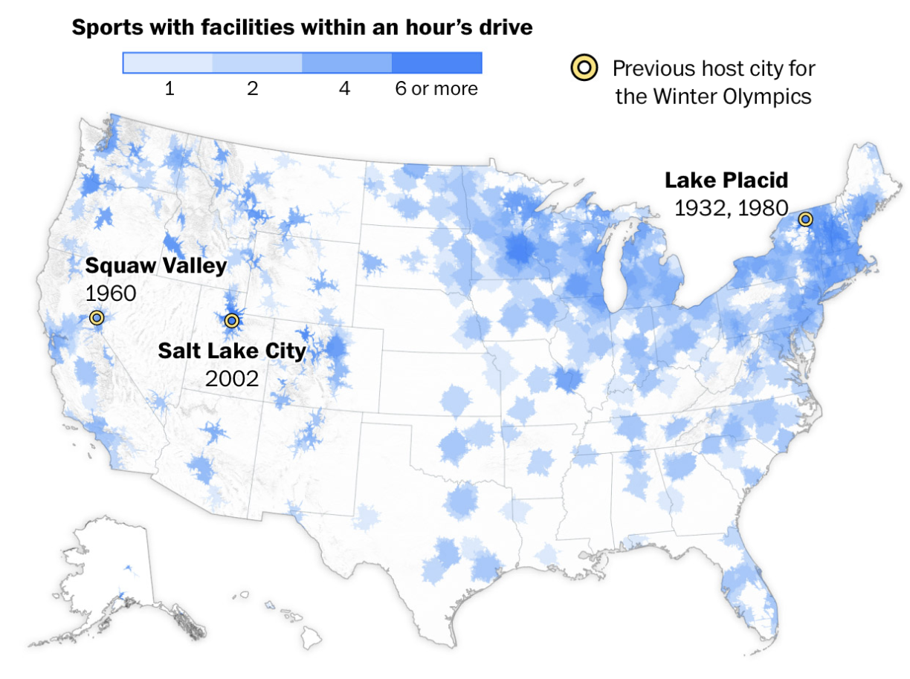

# Kwesi Mireku

This is where I'll complete the exercises for Homework 5.

## Exercise 2: Visualization Analysis

I chose to analyze the map showing access to Winter Olympic sports facilities across the United States.



[Access to Winter Olympic sports near you](https://flowingdata.com/2026/02/09/access-to-winter-olympic-sports-near-you/)

### b. What marks are being used? What variables are mapped to which properties?

The map uses area marks to show regions, with x and y encoding geographic position through longitude and latitude. Color intensity represents how many Winter Olympic sports facilities are within an hour's drive, where lighter blue means fewer facilities and darker blue means 6 or more. The yellow circle marks are plotted at the coordinates of previous Winter Olympics host cities.

### c. What is the main story of this graphic?

The map shows that access to Winter Olympic sports facilities is heavily concentrated in the Northeast, the Great Lakes region, and parts of the mountain West. Large parts of the South and central US have little to no access. That said, many of those empty areas also have low population density, so the story is less about "most Americans" and more about which regions of the country have the infrastructure to support winter sports.

### d. What makes it a good graphic?

The color coding is really intuitive, you immediately see the pattern without having to study it. The "within an hour's drive" measurement makes it relatable since you can think about your own location. It clearly tells the story that winter sports are only accessible in certain parts of the country.

### e. What features do you think you would know how to implement in Vega-Lite?

I think I could do the basic choropleth map with different colors for different values, add a legend, and plot points for the host cities. The color scale from light to dark seems pretty straightforward.

### f. Are there any features of the graphic that you would not know how to do in Vega-Lite?

The hardest part would be getting the drive-time geographic boundaries since that's custom geospatial data rather than standard county or state shapes. The text labels for host cities would actually be straightforward to add using a text layer in Vega-Lite with the city coordinates.


## Seattle Weather Exercises

### Exercise 1a: High temperature each day
```{r}
#| code-fold: true
library(vegawidget)

spec <- as_vegaspec(list(
  `$schema` = "https://vega.github.io/schema/vega-lite/v5.json",
  description = "High temperature in Seattle each day",
  data = list(
    url = "https://calvin-data304.netlify.app/data/weather-with-dates.csv"
  ),
  mark = "line",
  encoding = list(
    x = list(
      field = "date",
      type = "temporal",
      title = "Date"
    ),
    y = list(
      field = "temp_max",
      type = "quantitative",
      title = "High Temperature (°F)",
      scale = list(
        domain = list(0, 100)
      )
    )
  ),
  width = 600,
  height = 300
))

spec
```

### Exercise 1b: Temperatures overlaid by year
```{r}
#| code-fold: true
library(vegawidget)

spec <- as_vegaspec(list(
  `$schema` = "https://vega.github.io/schema/vega-lite/v5.json",
  description = "High temperatures overlaid by day of year",
  data = list(
    url = "https://calvin-data304.netlify.app/data/weather-with-dates.csv"
  ),
  transform = list(
    list(
      calculate = "month(datum.date)",
      `as` = "month"
    ),
    list(
      calculate = "date(datum.date)",
      `as` = "day"
    ),
    list(
      calculate = "year(datum.date)",
      `as` = "year"
    )
  ),
  mark = "line",
  encoding = list(
    x = list(
      field = "date",
      type = "temporal",
      timeUnit = "monthdate",
      title = "Day of Year"
    ),
    y = list(
      field = "temp_max",
      type = "quantitative",
      title = "High Temperature (°F)"
    ),
    color = list(
      field = "year",
      type = "nominal",
      title = "Year"
    )
  ),
  width = 600,
  height = 300
))

spec
```